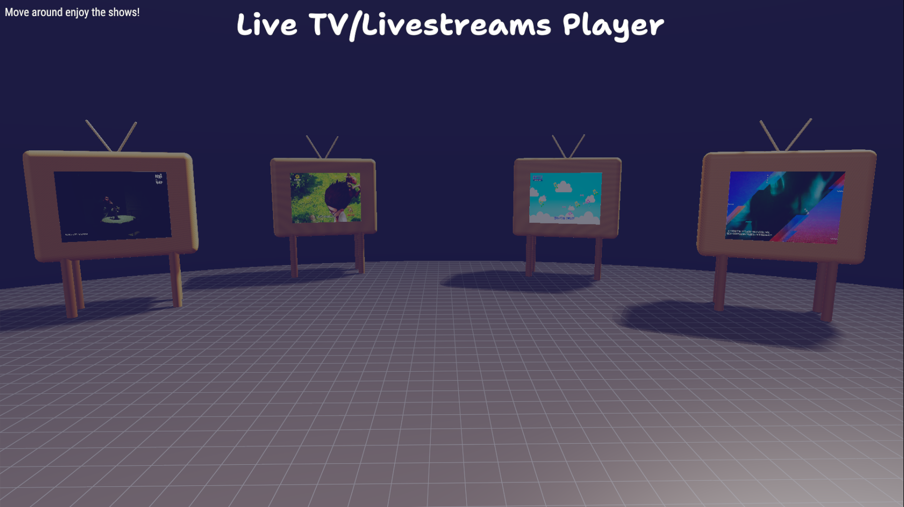
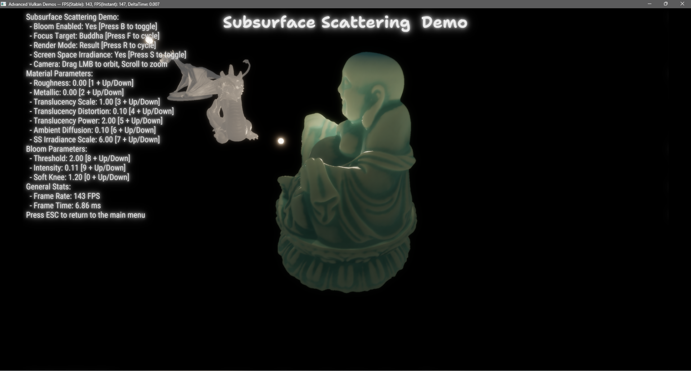
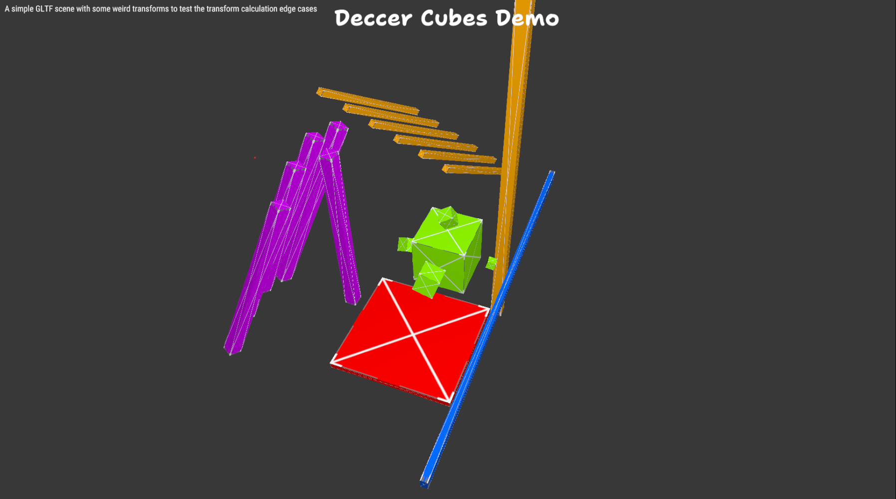
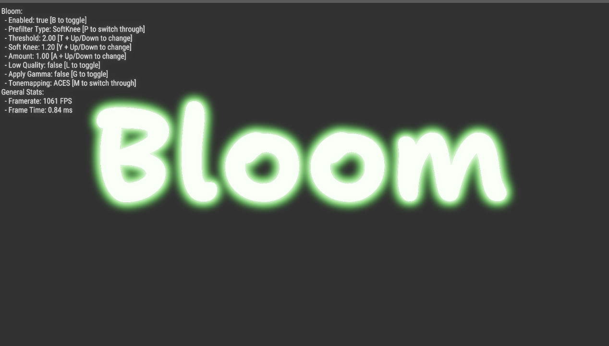

# Advanced Vulkan Demos (AVD)


AVD is a set of real-time rendering demos built from scratch in C on top of the Vulkan API. The primary goal of this project for me is to explore the more complex and advanced topics in Computer Graphics, Media Coding, Color Sciences, and GPGPU programming, while building a modular and reusable Vulkan engine architecture. I have designed this project as a powerfull Vulkan Engine, with a plugin based scene mangement system to create a variety of unrelated demos while still being able to build on top of a solid common base.

This project also acts as my personal portfolio and a code reference for myself and to any interested internet stranger. I tried my best to keep all parts of the project clean and well documented, and also for every demo/scene part of this project I have heavily docummented all the resources I have used and the research I have done in the process of building that demo, in the form of a markdown file with all the links to papers, articles, and other resources I have used. You can find those files in the `resources/` folder.

## Demos

Here are some of the demos currently implemented in the project. It is to be noted that they are not necessarily built in a particular order, they are just ideas and experiments I had in mind and wanted to try out, so they are all built independently of each other.


### Live TV / HLS Player

So I had the idea, that I wanted to play some sort of multimedia content in this engine, and I had been playing around with Vulkan Video once in a while this it gave me the idea to build something that gives me the excuse of implementing the Vulka Video infrastructure in this engine as well as be a fum project, soon after that I read a bit about the inner workings of TV channels(DVB) and I got curious and started building this. Just to challenge myself I gave myself a constraint, that I cannot use any existing library for the media work, and I ended up implementing [picoM3U8](https://github.com/Jaysmito101/libpico/blob/main/include/pico/picoM3U8.h), [picoMpegTS](https://github.com/Jaysmito101/libpico/blob/main/include/pico/picoMpegTS.h) and finally [picoH264](https://github.com/Jaysmito101/libpico/blob/main/include/pico/picoMpegTS.h) and then integrated all of them here along with the infra for Vulka Video.



### Subsurface Scattering

Multi-pass deferred renderer with multiple realtime subsurface scattering techniques. The pipeline runs through G-buffer generation, SSAO, PBR lighting, screen-space irradiance diffusion, and a final composite pass with some additional hybrid translucency techniques. Three 3D models (alien, buddha, stanford dragon) can be cycled through, each with tweakable material parameters — roughness, metallic, translucency scale/distortion/power, and irradiance radius. Bloom is integrated as a post process step.



### Deccer Cubes

This (most readers of this doc will probably know) is my solution to the [deccer-cubes](https://github.com/GraphicsProgramming/deccer-cubes) challenge from the Graphics Programming community and a nice testcase for my gltf loader and transform systems.



### Bloom

Configurable bloom post-processing effect. Supports multiple prefilter types (threshold, soft knee), adjustable intensity and threshold, quality toggle between full and half resolution, gamma correction, and switchable tonemapping operators (ACES, Reinhard, etc.). This implementation is based off of my old implementation of bloom for one of my OpenGL libraries [CGL](https://github.com/Jaysmito101/cgl) which in itself was built based on Unity's bloom implementation.




## Engine Components

This should give any newcomer a good idea of where you can find what in the engine.

| Module | Description |
|---|---|
| **Vulkan Abstraction** | Device, swapchain, framebuffers, images, buffers, pipelines, debug labels, and synchronization |
| **Scene Manager** | Plugin like architecture each demo registers init, load, update, render, destroy, and input event callbacks |
| **Shader System** | HLSL and GLSL compilation to SPIR-V via shaderc at build time, with Slang support(disabled) and shared include libraries |
| **Vulkan Video** | H.264 decode session management, DPB (decoded picture buffer) handling, bitstream parsing via libpico |
| **Font Rendering** | MSDF-based text rendering with multiple font support, built on atlases generated by msdf-atlas-gen |
| **Audio** | PortAudio based audio system with clip playback and streaming support |
| **Math** | Custom matrix, quaternion, and vector types with non-SIMD reference implementations |
| **Model Loading** | OBJ loading via tinyobjloader-c, glTF 2.0 loading via cgltf, with mesh generation utilities |
| **Asset Pipeline** | Python based build time processing shaders, fonts, images, and scene data are embedded as assets in the binary |
| **UI** | Lightweight immediate-mode style UI for parameter tweaking and debug overlays |


## Building

### Prerequisites

- **CMake 3.12+**
- **Vulkan SDK** (with shaderc libraries)
- **Python 3.x** (asset processing)
- **Visual Studio 2019+** (Windows) or **GCC/Clang** (Linux)

### Build

```bash
git clone --recursive https://github.com/Jaysmito101/AdvancedVulkanDemos.git
cd AdvancedVulkanDemos
mkdir build && cd build
cmake ..
cmake --build . --config Release
```

Or if you are on windows we have a really nice  `run.bat` file in the root of the project that will do all of this for you + more like choosing between msvc, clang, etc, shader lib updation, etc.

``
run.bat --ninja
``

### Dependencies

All third-party libraries are included as git submodules under `dep/`:

| Library | Purpose |
|---|---|
| [GLFW](https://github.com/glfw/glfw) | Windowing and input |
| [Volk](https://github.com/zeux/volk) | Dynamic Vulkan function loader |
| [STB](https://github.com/nothings/stb) | Image loading |
| [cgltf](https://github.com/jkuhlmann/cgltf) | glTF 2.0 parsing |
| [tinyobjloader-c](https://github.com/syoyo/tinyobjloader-c) | OBJ model loading |
| [PortAudio](https://github.com/PortAudio/portaudio) | Cross-platform audio I/O |
| [libpico](https://github.com/Jaysmito101/libpico) | Bunch of tiny single-header libraries |

Shader compilation requires **shaderc** from the Vulkan SDK.

---

## License

MIT License

## Author

**Jaysmito Mukherjee** — [GitHub](https://github.com/Jaysmito101) · [LinkedIn](https://linkedin.com/in/jaysmito) · [Twitter](https://twitter.com/Jaysmito101)


