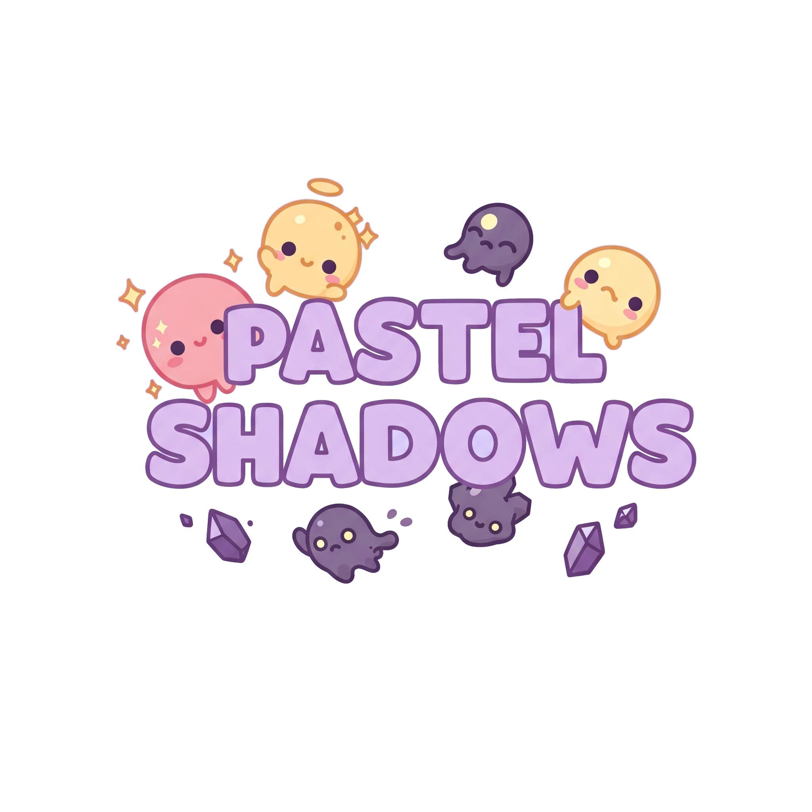

  

<h1 align="center">Pastel Shadows</h1>

  <i>A cute, open-source game built from scratch using Vulkan with minimal dependencies.</i>

---

## About The Project

Pastel Shadows is a fully open-source game I am developing from scratch just to have fun playing around with Vulkan, game engine development and SDFs. Literally, most of the elements in this game are or would be SDFs. The game is designed to be super cute and fun, with a focus on simplicity and minimalism. The project is built purely using C11 and Vulkan 1.2, with no external dependencies (except glfw, stb... must haves).

### NOTE: Proper README file coming soon!

## Screenshots

  
  

*(More screenshots coming soon!)*

## Features (Planned/In Progress)

*   **Custom Game Engine:** Built from the ground up.
*   **Vulkan Renderer:** Leveraging the power and flexibility of the Vulkan API.
*   **Minimal Dependencies:** Reducing reliance on external libraries.
*   **Cross-Platform:** Aiming for compatibility with multiple operating systems (Windows, Linux).
*   **Open Source:** Community-driven development.

## Contributing

Not currently accepting contributions, but feel free to reach out if you have suggestions or want to collaborate!

## Contact

** Jaysmito Mukheree - jaysmito101@gmail.com - https://github.com/jaysmito/pastel_shadows**